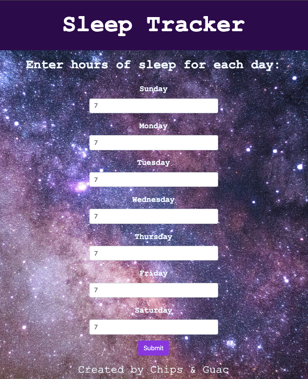
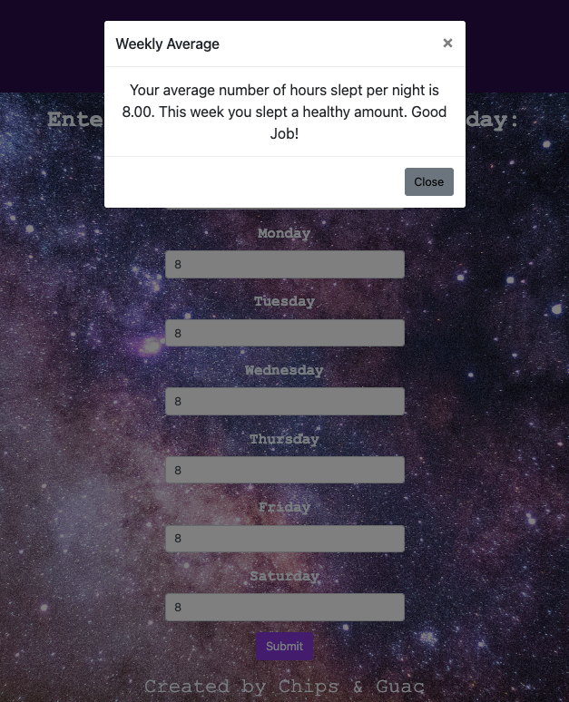
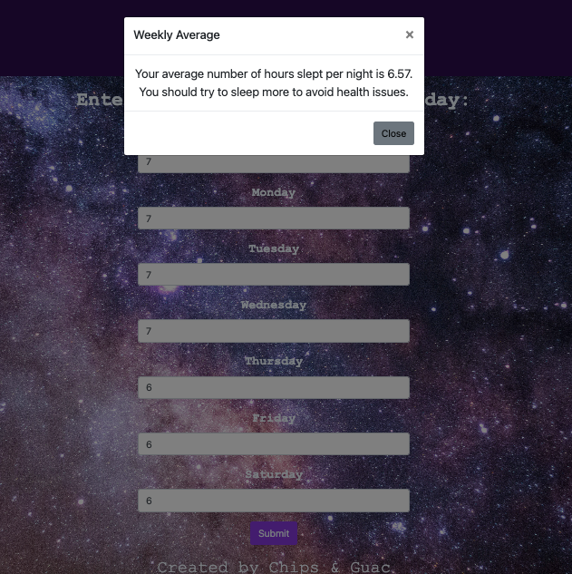

# 05-Project-1: Sleep Tracker

## User Story

```md
AS A software developer, 
WE WANT a website that keeps track of the user's sleep habits
SO THAT users can see their average sleep time to see if they're getting enough sleep each night.
```

## Description

We are creating a sleep tracker website. The user will be able to keep track of the amount of sleep they get each night, and the website will tell them their average number of hours of sleep and whether they are sleeping enough. 

To accomplish this, we have designed a user-friendly Web App that will allow users to easily track the average amount of sleep they get per night, based on a seven-day period. The "Sleep Tracker" Web App, consists of a single column displaying a seven-day week (Sunday through Saturday) with drop-down input boxes for each day. Users can enter their hours of sleep per night by either using the drop-down option or by entering their hours manually. At the end of each week, the users' average hours of sleep per night will display in a pop-up (modal) box. 

## Technologies used

```md
HTML
CSS
JavaScript
CSS Framework-Bootstrap 4.2.1
```

## Mock-Up

The following images demonstrate the application functionality:







## Deployed Application

https://ivandamian1.github.io/Project-1/